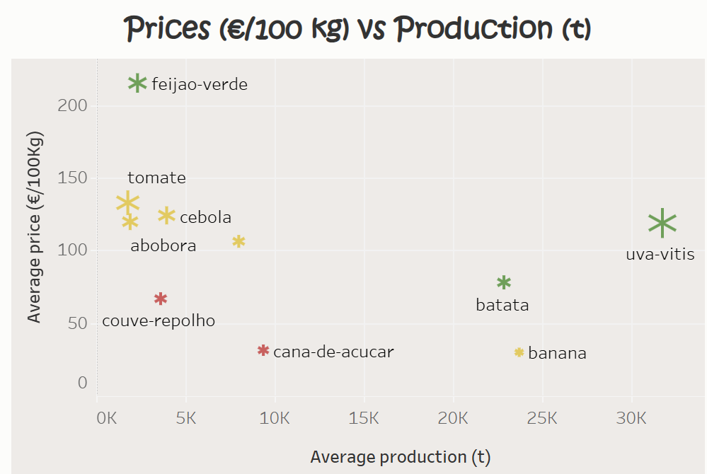
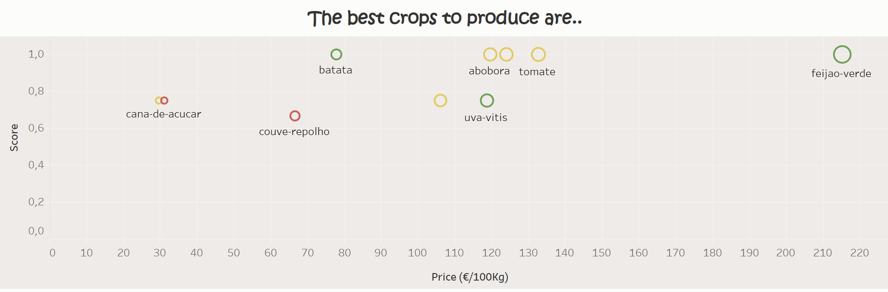

# **🌱 Crop Genie – Agronomic & Economic Advisor for Madeira**

**📌 Context**

Madeiran agriculture faces unique challenges:
- Small and sloped plots,
- High climatic risk,
- Elevated production costs,
- Limited access to funding lines.

Choosing what to plant isn’t trivial. This project aims to help farmers and decision-makers answer three key questions:
- Which crops are agronomically viable?
- Are they economically sustainable under current conditions?
- Which funding lines are available to support the decision?

**🎯 Objective**

Build an interactive tool that combines historical price and production data with soil and climate conditions and average production costs, to provide an integrated recommendation on which crops to plant and how to finance them.

**📂 Project Structure**

- Worked_datasets/ → cleaned final dataset (for Tableau and Streamlit).
- Code/ → Python scripts and Streamlit app (app.py).
- Charts/ → statistical analyses (correlations, ANOVA, regressions).
- pepac.json → funding lines used in the recommendation engine.
- Tableau Dashboard → exploratory visualization for presentation.

## ⚙ **Tech Stack**  
- Python 🐍  
- Pandas 📊  
- Matplotlib 📈  
- Seaborn 🎨    
- Tableau 📊
- Streamlit 👩‍💻

**🔍 Methodology**

*Data integration:*
- Time series of prices and production (2010–2024).
- Climatic and soil indicators.
- Agronomic specifics of each crop.
- Average production costs (vegetables: €3,413/ha; fruit crops: €10,500/ha).
- Funding opportunities PEPAC Madeira

*Statistical analysis (Python)*
- Correlations (Spearman, Pearson).
- Hypothesis testing (ANOVA, Mann–Whitney, OLS regressions).
- Recommendation robustness (weight variation).

*Interactive prototype (Streamlit):*
- Agronomic assessment → climate/soil suitability scoring.
- Economic assessment → expected profit adjusted for risk.
- Funding suggestions → rule-based system using PEPAC data.
- Final decision → combines agronomic, economic, and funding viability.

*Visualization (Tableau):*
Interactive dashboard to explore production, prices, and profit margins by crop.

**EDA**

**🚀 How to Use**

https://appriskpy.streamlit.app/

**🖥️ Features**

- Choose an existing crop or create a new one.
- Simulate area and operational costs.
- Calculate expected profit under climate risk.
- Automatically get tailored funding recommendations.
- Final summary combining Agronomy → Economy → Financing into a single decision.

**📈 Next Steps**
- Incorporate soil and zoning maps of Madeira for location-based recommendations.
- Enhance economic model with price variation (optimistic vs pessimistic scenarios).
- Simulate the impact of extreme climate events.
- Optimize ideal cultivation area.

**👩‍💻 Links**
- [Tableau](https://public.tableau.com/app/profile/sofia.ara.jo/viz/analysis_2_17589800399590/Painel1)
- [Project Presentation](ironhack_final_presentation.pdf)

**👩‍💻 Author**
Final project developed by [Sofia Araújo](https://github.com/SofyMelvill) as part of the Ironhack Data Analytics Bootcamp.